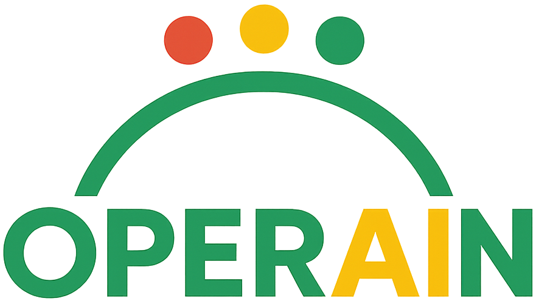

<p align="center">
  
</p>

###### *The **OPERAIN** logo is a simple promise in visual form: we take intelligence and make it safely operational. The green letters **OPER** and **N** stand for trusted, day-to-day operations—“green means go.” The yellow **AI** highlights the decision-making piece that deserves extra attention before it goes live. Above the name, a clean green arch represents one governed doorway from planning to production, while the three dots—red, yellow, green—echo our stop-review-go lanes for quality and compliance. Together, the mark says: OPERAIN guides ideas through careful review into reliable, audit-ready operations, all in one smooth flow.*
---
> **OPERAIN** is a seven-step suite that turns a site walk into running, audit-ready operations—plan the deployment, procure and provision hardware, compare models, run real-time QA, answer SOPs with proof, deploy safely, and continuously improve.

---

## Table of contents

* [Overview](#overview)
* [Who it helps](#who-it-helps)
* [Seven steps at a glance](#seven-steps-at-a-glance)
* [Detailed steps](#detailed-steps)
* [Suite vs. standalone tools](#suite-vs-standalone-tools)
* [End-to-end vertical workflow (Mermaid)](#end-to-end-vertical-workflow-mermaid)
* [Architectural view (Mermaid)](#architectural-view-mermaid)
* [Primary use cases](#primary-use-cases)
* [User stories](#user-stories)
* [Technology, explained simply](#technology-explained-simply)
* [Data model & evidence locker](#data-model--evidence-locker)
* [Integrations](#integrations)
* [Security & compliance](#security--compliance)
* [Install & quick start](#install--quick-start)
* [Project structure](#project-structure)
* [Roadmap](#roadmap)
* [FAQ](#faq)
* [Contributing](#contributing)
* [License](#license)

---

## Overview

OPERAIN is a **one-front-door** platform for operations teams that need to:

* plan a camera/sensor deployment,
* buy and prepare the gear,
* choose the best AI model with proof,
* run real-time checks on the floor,
* get policy/SOP answers with citations,
* ship safe updates with approvals and rollbacks,
* and keep improving with evidence.

Think: **Plan → Provision → Prove → Run → Comply → Operate → Improve.**

---

## Who it helps

| Role                               | What they get                                           | Why it matters                    |
| ---------------------------------- | ------------------------------------------------------- | --------------------------------- |
| **Operations/Plant Manager**       | One place to start, see status, and export audit packs  | Faster pilots, fewer meetings     |
| **Quality Manager**                | Pass/fail proofs, CAPA flow, SOP answers with citations | Clean inspections, lower risk     |
| **Process/Manufacturing Engineer** | Coverage plans, wiring/power maps, model reports        | Clarity from day one              |
| **Platform/SRE/IT-OT**             | Safe, signed releases; policy checks; rollbacks         | Fewer outages; traceable changes  |
| **Line Supervisor/Operator**       | Simple UI: green/yellow answers; pass/fail dashboard    | Less confusion during changeovers |
| **Auditor/Compliance**             | Time-stamped evidence locker; provenance receipts       | Audit-ready without the scramble  |

**Industries:** Pharma/medical devices, food & beverage/CPG, automotive/electronics assembly, logistics/3PL, large retail ops, data centers, hospitals.
**Also fits:** Any place with a process to watch, rules to follow, and systems that must run safely.

---

## Seven steps at a glance

1. **Plan (BayWalk)** – Turn a site walk into a buying list, coverage layout, wiring/power plan, and bite-size tasks.
2. **Procure & Provision** – Convert the plan to POs; label, image, and enroll devices; record serials.
3. **Prove (PerceptionLab)** – Test models on real clips; print an accuracy/speed report anyone can read.
4. **Run (EdgeSight-QA)** – Watch the line with edge devices; send pass/fail back to plant systems; keep proof.
5. **Comply (RAINLane)** – SOP/policy answers with citations; green = safe, yellow = human review.
6. **Operate (DriftHawk)** – Safe, signed releases with approvals, policy checks, and rollbacks.
7. **Improve (CAPA & Retrain)** – Capture misses → fix → re-test → redeploy, with evidence.

---

## Detailed steps

### 1) Plan — *from walk-through to work plan*

* **For**: PMs, architects, process engineers
* **Outputs**: camera placement, occlusion checks, **hardware BOM** (shopping list), **power/PoE** plan, network notes, and ready-to-start tasks (Jira stories).
* **Plain talk**: like planning home security—how many cameras, where, what to buy, and a to-do list for the installer.

### 2) Procure & Provision — *buy and prep the gear*

* **For**: purchasing, IT/OT
* **Outputs**: POs; **device vault** (asset list with serial/MAC), golden image, zero-touch enrollment; camera discovery with saved RTSP creds.
* **Plain talk**: get the boxes, put your name on them, turn them on ready-to-work.

### 3) Prove — *pick the best model with receipts*

* **For**: quality, data/ML, engineering
* **Outputs**: head-to-head accuracy (mAP/IoU/IDF1), latency, PDF report with frames; “promote to ready” button.
* **Plain talk**: test two “camera brains,” see which wins, keep a report.

### 4) Run — *real-time QA on the floor*

* **For**: operators, supervisors
* **Outputs**: per-item pass/fail, reason codes, snapshots; write-backs to **Ignition/MQTT/OPC-UA**; alerts when attention is needed.
* **Plain talk**: a calm helper that watches the line and lights up green/red.

### 5) Comply — *answers with proof*

* **For**: anyone following SOPs (operators, supervisors)
* **Outputs**: short answer + exact page/paragraph; **green lane** = safe; **yellow lane** = human check.
* **Plain talk**: “What do we do for Lot Code X?” → shows the rule, not just a guess.

### 6) Operate — *ship changes safely*

* **For**: platform/SRE, release managers
* **Outputs**: **policy gates** (rules in code), **signed images/SBOMs**, approvals, and quick rollbacks; GitOps sync so the cluster matches Git.
* **Plain talk**: a careful foreman who checks permits, signs receipts, and follows the blueprint exactly.

### 7) Improve — *fix, re-test, redeploy*

* **For**: quality, data/ML, SRE
* **Outputs**: incidents → CAPA → re-test in Prove → signed rollout in Operate → new evidence pack.
* **Plain talk**: when something fails, we learn from it and improve on purpose.

---

## Suite vs. standalone tools

All five core tools work alone **or** inside OPERAIN.

| Step | Tool              | Can run standalone? | Typical standalone buyers           |
| ---- | ----------------- | ------------------- | ----------------------------------- |
| 1    | **BayWalk**       | ✅                   | PMO, SI partners, site survey teams |
| 3    | **PerceptionLab** | ✅                   | Data/ML teams, QA labs, vendors     |
| 4    | **EdgeSight-QA**  | ✅                   | Factory/warehouse ops, integrators  |
| 5    | **RAINLane**      | ✅                   | Compliance/HR/IT helpdesks          |
| 6    | **DriftHawk**     | ✅                   | Platform/SRE, DevOps, security      |

Steps **2 (Procure & Provision)** and **7 (Improve/CAPA)** are **suite-only glue** that make the end-to-end flow seamless.

<p align="center">
  <a href="https://github.com/aurelius-in/BayWalk">
    
  </a>
  &nbsp;&nbsp;&nbsp;&nbsp;
  <a href="https://github.com/aurelius-in/RAINLane">
    
  </a>
  &nbsp;&nbsp;&nbsp;&nbsp;
  <a href="https://github.com/aurelius-in/perception-lab">
    
  </a>
  &nbsp;&nbsp;&nbsp;&nbsp;
  <a href="https://github.com/aurelius-in/DriftHawk">
    
  </a>
  &nbsp;&nbsp;&nbsp;&nbsp;
  <a href="https://github.com/aurelius-in/EdgeSight-QA">
    
  </a>
</p>


---

## End-to-end workflow 


---

## Architectural view (Mermaid)


---

## Primary use cases

* **Factory/Line QA:** inspect products in real time, cut scrap, and stay audit-ready.
* **Warehouse/3PL:** verify packing/labeling, reduce rework, keep a photo trail.
* **Retail operations:** plan coverage, detect shelf issues, answer policy questions, govern updates.
* **Healthcare ops (non-PHI):** room turnover checks, hand-hygiene observation, SOP answers, signed changes.
* **Data centers:** site survey for sensors, anomaly detection bakeoffs, change governance.

---

## User stories

1. **Quality Manager (Pharma)**
   “I need to prove Model B is better than Model A before validation.”

   * Upload clips → **Prove** → PDF shows +14% accuracy, −20% latency → **Operate** promotes with signatures → **Comply** references SOP during changeover → **Improve** catches glare cases and re-tests.

2. **Ops Director (3PL)**
   “I want fewer mis-labels and clean audits.”

   * **Plan** camera angles at pack stations → **Procure & Provision** → **Run** marks pass/fail with snapshots → **Comply** answers packaging rules → **Improve** turns misses into CAPA tickets.

3. **Platform Lead (Retail)**
   “We can’t risk ad-hoc updates.”

   * Use **Operate** to enforce policy gates and signed images → roll out a config change → rollback in seconds when a canary fails.

4. **Line Supervisor (Bakery)** *fun example*
   “Our cupcakes need enough frosting.”

   * **Run** detects coverage; **Comply** answers “what’s acceptable?” with a picture and paragraph; **Improve** stores bad examples to retrain.

---

## Technology, explained simply

* **Kubernetes/OpenShift (the engine room):** runs containers reliably.
* **GitOps (the blueprint):** the cluster stays in sync with what’s in Git.
* **KServe (model serving):** a standard way to deploy ML models.
* **Policy-as-code (OPA):** rules like “only signed images” or “no public ports,” enforced automatically.
* **SBOM + Signing (cosign/Syft/Grype):** ingredient lists and cryptographic signatures so you know what’s running.
* **SCADA connectors (Ignition/MQTT/OPC-UA):** talk to plant systems in their language.
* **Metrics (Prometheus/Grafana):** charts that show health and latency; *ops signals* to act on.
* **FastAPI services:** light, fast backends binding everything together.

**Why combine them, in this order?**
You can’t run safely until you **plan** and **provision**; you shouldn’t choose a model until you **prove** it; the line only trusts results when you **comply** (answers with proof) and **operate** with signed, governed releases; you get better when you **improve** with evidence.

---

## Data model & evidence locker

Key tables (simplified):

| Table           | Purpose           | Example fields                               |
| --------------- | ----------------- | -------------------------------------------- |
| `site`          | group by location | id, name, timezone                           |
| `project`       | track deployments | id, site_id, status                          |
| `bom_item`      | what to buy       | sku, qty, alt_sku, eta, cost_monthly         |
| `asset`         | devices           | serial, mac, model, location, status         |
| `model_version` | models            | name, sha, registry_url                      |
| `eval_report`   | proofs            | map, iou, idf1, latency_ms, url              |
| `incident`      | misses            | image_url, log_url, severity                 |
| `capa`          | fixes             | owner, root_cause, due_date, status          |
| `release`       | deployments       | model_version_id, result, signed_receipt_url |

**Evidence locker** = one searchable place for reports, signed receipts, pass/fail snapshots, and approvals.

---

## Integrations

| Category      | Examples                     |
| ------------- | ---------------------------- |
| SSO           | Okta, Azure AD               |
| SCADA/OT      | Ignition, MQTT, OPC-UA       |
| Tickets       | Jira, ServiceNow             |
| Cloud/On-prem | OpenShift/K8s, AWS/GCP/Azure |
| Storage       | S3/Azure Blob                |
| Observability | Prometheus, Grafana          |
| Security      | OPA, cosign, Syft, Grype     |

---

## Security & compliance

* **Signed supply chain:** images are signed; SBOMs generated; provenance attached.
* **Policy gates:** unsafe changes block automatically.
* **Audit readiness:** timestamps, sources, and approvals are saved by default.
* **Offline-safe ops:** edge keeps running; syncs when back online.

---

## Install & quick start

> **Prereqs:** Kubernetes/OpenShift cluster, container registry, Git, and access to SCADA connectors where applicable.

```bash
# 1) Clone hub + services (monorepo or submodules)
git clone https://github.com/your-org/operain-hub
cd operain-hub

# 2) Bootstrap namespaces & secrets
make bootstrap          # sets namespaces, registry creds, signing keys

# 3) Deploy core services
make deploy-core        # hub ui, locker api, auth, grafana

# 4) Enable tiles as needed
make enable-baywalk enable-perceptionlab enable-edgesight enable-rainlane enable-drifthawk

# 5) (Suite only) enable glue steps
make enable-procure enable-improve
```

Open the hub, create a **Project**, and start at **Plan**.

---

## Project structure

```
operain/
  hub-ui/                  # React/TS front door (7 tiles)
  locker-api/              # Evidence Locker (FastAPI + DB)
  baywalk/                 # Plan
  procure/                 # Procure & Provision (suite)
  perceptionlab/           # Prove
  edgesight-qa/            # Run
  rainlane/                # Comply
  drifthawk/               # Operate
  improve/                 # CAPA & Retrain (suite)
  deploy/                  # Helm charts / Kustomize / Argo CD apps
  docs/                    # Guides, diagrams, assets
```

---

## Roadmap

* Model registry UI (promote, compare, retire)
* Digital-twin coverage simulator (pre-purchase “what-ifs”)
* More SCADA templates (Ignition views, OPC-UA tags)
* Auto-generated Audit Pack ZIP by batch/SKU
* Fleet health (camera uptime, edge temps, queue depth)
* Cost/ROI board (scrap, rework, downtime deltas)

---

## FAQ

**Is this factory-only?** No—works for warehouses, retail, hospitals, data centers.
**Can we buy just one tool?** Yes; the suite adds procurement, CAPA, and a shared evidence locker.
**Air-gapped?** Yes—signed artifacts, offline-safe ops, GitOps workflows.
**Do I need data scientists?** Not to start; you can use prebuilt models and still get reports and proofs.

---

## Contributing

PRs welcome! Please open an issue first for major changes. See `docs/CONTRIBUTING.md`.

*Questions or demo requests?* Open an issue or contact the maintainers.
